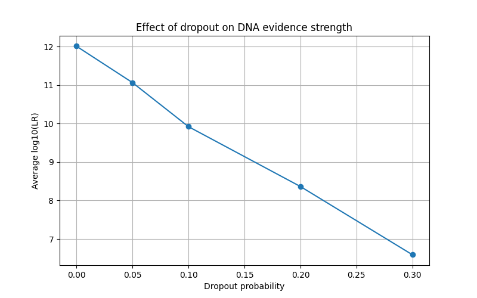
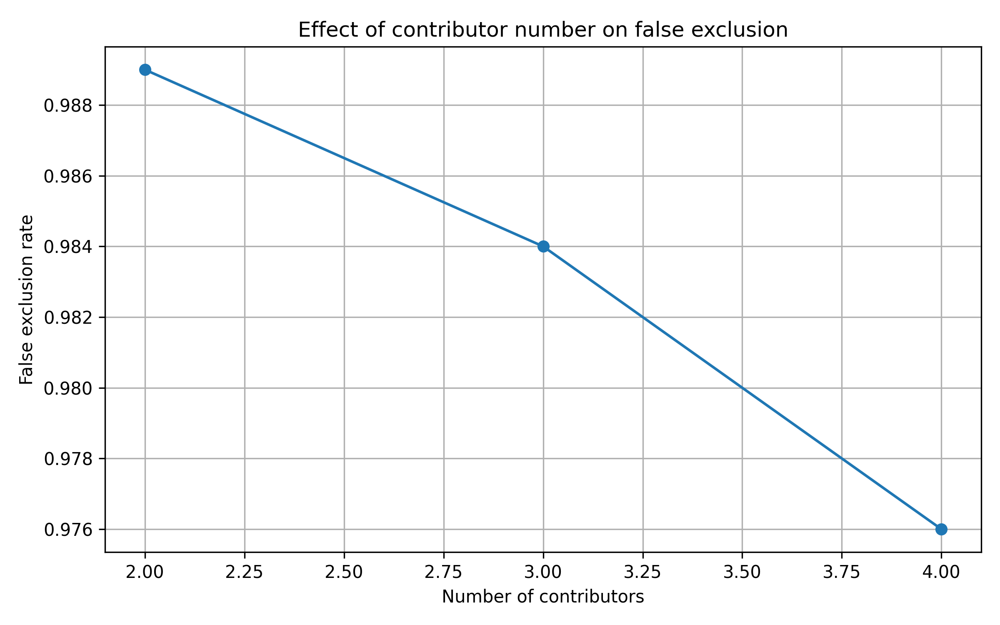

# Forensic DNA Mixture Lab

Educational forensic bioinformatics project for studying DNA mixture interpretation, allele dropout, and likelihood ratios using simulated STR profiles.

---

## Overview

Forensic DNA mixtures are commonly encountered in criminal investigations. Interpretation becomes more difficult when allele dropout occurs, potentially leading to false exclusions of true contributors.

This project provides a simulation framework for exploring:

* STR profile generation
* DNA mixture creation
* Population allele frequencies
* Allele dropout simulation
* Suspect exclusion testing
* Likelihood ratio calculations
* Monte Carlo experiments

---

## Research Questions

1. How does allele dropout affect false exclusion rates?
2. How does the number of STR markers influence robustness?
3. How does dropout affect the strength of DNA evidence?
4. How do likelihood ratios change under different dropout scenarios?

---

## Implemented Features

* STR profile simulation
* DNA mixture generation
* Population allele frequency sampling
* Allele dropout simulation
* Suspect exclusion analysis
* Simple likelihood ratio model
* Frequency-based likelihood ratio model
* Monte Carlo simulation framework
* Automated result visualization

---

## Experiments

### 1. Dropout Experiment

Evaluates the effect of allele dropout on false exclusion rates.


Example results:

| Dropout Probability | False Exclusion Rate |
| ------------------- | -------------------- |
| 0.00                | 0.000                |
| 0.05                | 0.596                |
| 0.10                | 0.834                |
| 0.20                | 0.979                |
| 0.30                | 0.998                |

---

### 2. Marker Count Experiment

Evaluates how increasing the number of STR markers influences exclusion outcomes.


Example results:

| Number of Markers | False Exclusion Rate |
| ----------------- | -------------------- |
| 1                 | 0.175                |
| 2                 | 0.300                |
| 3                 | 0.471                |
| 4                 | 0.563                |

Under a strict exclusion model, increasing the number of markers can increase false exclusion rates because additional loci provide more opportunities for allele dropout to affect the interpretation.

---

### 3. Likelihood Ratio Experiment

Evaluates how allele dropout affects the evidential strength of DNA profiles.



Example results:

| Dropout Probability | Average log10(LR) |
| ------------------- | ----------------- |
| 0.00                | 12.014            |
| 0.05                | 11.068            |
| 0.10                | 9.922             |
| 0.20                | 8.364             |
| 0.30                | 6.590             |

Results show that increasing dropout substantially reduces evidential strength.

---
## Contributor experiment



| Contributors | False exclusion rate |
|-------------|---------------------|
| 2 | 0.989 |
| 3 | 0.984 |
| 4 | 0.976 |

---

## Likelihood Ratio Models

### Simple Likelihood Ratio

A simplified educational model based on the number of STR markers consistent with the suspect profile.

### Frequency-Based Likelihood Ratio

A more realistic educational model based on population allele frequencies.

Genotype probabilities are estimated as:

* Homozygous genotype: p²
* Heterozygous genotype: 2pq

Combined likelihood ratios are calculated across compatible loci.

---

## Example Output

```text
EXCLUSION TEST
Suspect excluded

SIMPLE LIKELIHOOD RATIO
LR = 5.000

FREQUENCY-BASED LR
LR = 127013158563.227
```

---

## Project Structure

```text
forensic-dna-mixture-lab/
│
├── data/
│   └── allele_frequencies.csv
│
├── reports/
│   ├── dropout_experiment.png
│   ├── marker_experiment.png
│   ├── lr_experiment.png
│   ├── dropout_results.csv
│   ├── marker_results.csv
│   └── lr_results.csv
│
├── src/
│   ├── simulator.py
│   ├── likelihood.py
│   ├── experiment.py
│   ├── marker_experiment.py
│   ├── lr_experiment.py
│   ├── plot_results.py
│   ├── plot_marker_results.py
│   └── plot_lr_results.py
│
└── README.md
```

---

## Future Work

* Probabilistic genotyping
* Multi-contributor mixtures
* Peak height simulation
* Stutter modelling
* Population-specific allele frequencies
* Bayesian evidence evaluation
* Validation against published forensic datasets

---

## Disclaimer

This project is intended for educational and research-training purposes only.

It is not validated for forensic casework and must not be used in real criminal investigations.
