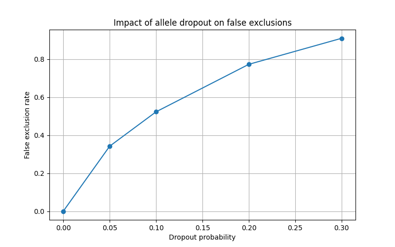
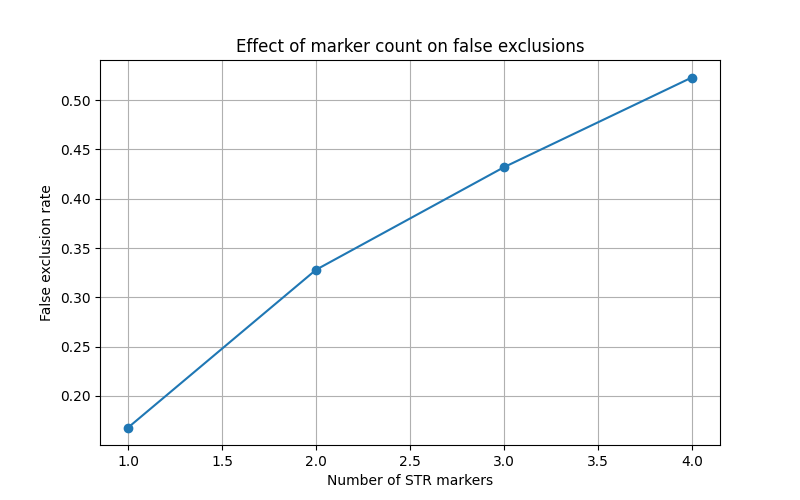

# Forensic DNA Mixture Lab

Simulation framework for studying the impact of allele dropout on forensic DNA mixture interpretation.

## Research questions

1. How does allele dropout affect false exclusion rates?
2. How does the number of STR markers influence robustness?
3. How many markers are needed to reduce false exclusions?
   
## Features

- STR profile simulation
- DNA mixture generation
- Population allele frequencies
- Allele dropout simulation
- Suspect exclusion analysis
- Monte Carlo experiments

## Example result

False exclusion rate increases with dropout probability.

| Dropout | False exclusion |
|----------|----------|
| 0.00 | 0.000 |
| 0.05 | 0.342 |
| 0.10 | 0.523 |
| 0.20 | 0.773 |
| 0.30 | 0.910 |

## Results

### Dropout experiment

### Marker experiment

Observed false exclusion rates:

| Markers | False exclusion rate |
|----------|----------|
| 1 | 0.168 |
| 2 | 0.328 |
| 3 | 0.432 |
| 4 | 0.523 |

Unexpectedly, false exclusion increased with the number of markers under a strict exclusion model. This occurs because each additional marker creates another opportunity for allele dropout to trigger exclusion.

## Figure

## Likelihood Ratio

The project includes a simple educational likelihood ratio model.

This simplified LR compares the number of STR markers consistent with the suspect profile against markers inconsistent with the suspect profile.

It is intended only as a teaching example and is not suitable for forensic casework.

## Scientific question

How does allele dropout affect false exclusion rates in simulated forensic DNA mixtures?

## Disclaimer

This project is for educational and research training purposes only.
It is not validated for forensic casework and must not be used in real investigations.
